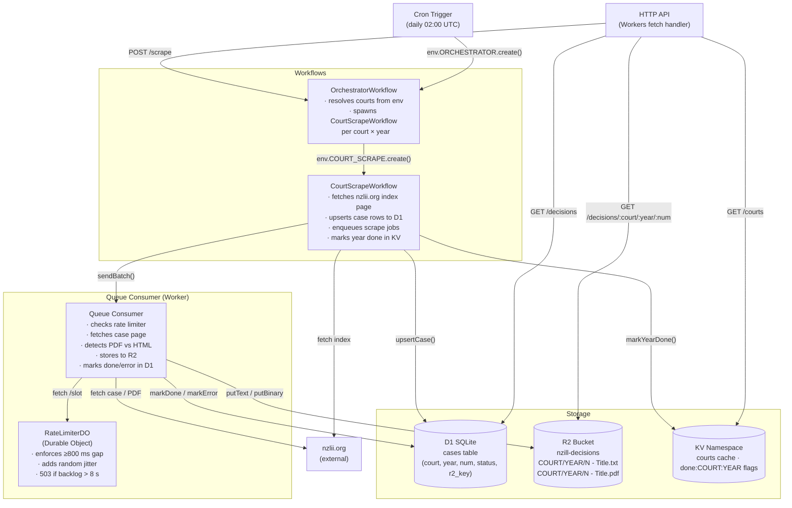
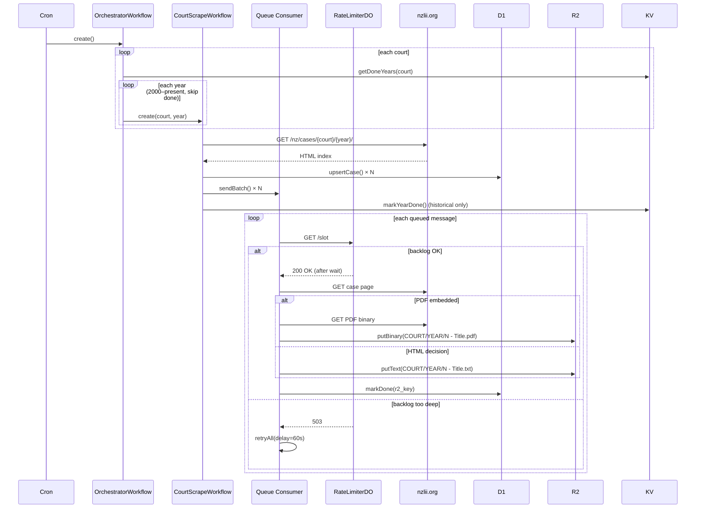

# nzill

A Cloudflare Workers scraper that fetches New Zealand court decisions from [nzlii.org](http://www.nzlii.org) and stores them as plain text or PDF in R2 object storage.

## Overview

nzill runs entirely on Cloudflare's edge infrastructure. A nightly cron triggers the orchestrator, which fans out one Workflow per court per year, enqueues individual case scrape jobs, and a rate-limited queue consumer fetches and stores each decision.

## Cloud Architecture



### Data flow



### Storage layout

| Store  | Key pattern                | Contents                                                            |
| ------ | -------------------------- | ------------------------------------------------------------------- |
| **R2** | `COURT/YEAR/N - Title.txt` | Extracted decision text (HTML decisions)                            |
| **R2** | `COURT/YEAR/N - Title.pdf` | Raw PDF binary (PDF-embedded decisions)                             |
| **D1** | `cases` table              | `(court, year, num, title, url, status, r2_key, error, scraped_at)` |
| **KV** | `courts`                   | Cached JSON list of all 135 NZ courts (7-day TTL)                   |
| **KV** | `done:COURT:YEAR`          | Sentinel — historical year fully scraped, skip on next run          |

## HTTP API

| Method | Path                              | Description                                              |
| ------ | --------------------------------- | -------------------------------------------------------- |
| `GET`  | `/courts`                         | List all NZ courts (KV-cached, refreshed from nzlii.org) |
| `GET`  | `/decisions?court=NZSC&year=2024` | List decisions for a court-year from D1                  |
| `GET`  | `/decisions/:court/:year/:num`    | Stream the stored decision (text or PDF) from R2         |
| `POST` | `/scrape`                         | Manually trigger the orchestrator                        |

## Project structure

```
src/
  index.ts                   # Worker entry point — HTTP handler, queue consumer, scheduled trigger
  types.ts                   # Shared types, schemas (Effect Schema), error constructors
  workflows/
    orchestrator.ts           # OrchestratorWorkflow — fans out court × year jobs
    court-scrape.ts           # CourtScrapeWorkflow — indexes one court/year, enqueues cases
  objects/
    rate-limiter.ts           # RateLimiterDO — global polite-crawl rate limiter
  lib/
    d1.ts                     # D1 queries (upsertCase, markDone, markError, queryCases)
    kv.ts                     # KV helpers (courts cache, year-done flags)
    parse.ts                  # HTML parsing (courts list, case links, text extraction, PDF detection)
    r2.ts                     # R2 helpers (headObject, putText, putBinary, makeR2Key)
scrape.ts                    # Local CLI scraper (no Cloudflare — writes to output/)
schema.sql                   # D1 schema migration
wrangler.toml                # Cloudflare resource bindings
```

## Development

### Prerequisites

- [mise](https://mise.jdx.dev) — manages Node.js, pnpm, pkl, hk
- A Cloudflare account with Workers Paid (Workflows + Queues require it)

### Setup

```sh
mise install          # install Node, pnpm, pkl, hk
mise run install      # pnpm install --frozen-lockfile
```

### Local CLI scraper

A standalone `scrape.ts` runs against nzlii.org directly and writes files to `output/` — no Cloudflare account needed.

```sh
mise run scrape                   # list all 135 NZ courts
mise run scrape NZSC              # list Supreme Court years
mise run scrape NZSC 2024         # scrape all 2024 Supreme Court decisions
```

### Wrangler dev

```sh
mise run dev          # wrangler dev (local Workers simulator)
```

> **Note:** `fetch()` inside `step.do()` is not supported in the local wrangler simulator. The orchestrator and court-scrape workflows work correctly in production only.

### Trigger a manual scrape

```sh
# Via HTTP (wrangler dev running)
curl -X POST http://localhost:8787/scrape

# Via Cloudflare Dashboard → Workers → nzill → Triggers → Cron → Run
# Or: Dashboard → Workflows → orchestrator → Create instance
```

## Testing

```sh
mise run test             # node:test unit tests (parse, kv, r2, d1)
mise run test:workers     # Vitest Workers pool — RateLimiterDO + HTTP handler integration tests
mise run typecheck        # oxlint --type-check --type-aware
mise run lint             # oxlint --type-aware --fix
mise run fmt              # oxfmt (auto-fix)
mise run fmt:check        # oxfmt --check (CI)
```

## CI / CD

GitHub Actions workflows are generated from PKL sources in `.github/pkl/`. **Edit the `.pkl` files, not the generated YAML.**

```sh
mise run pkl:gen          # regenerate .github/workflows/*.yml
```

| Workflow   | Trigger                                 | Steps                                                  |
| ---------- | --------------------------------------- | ------------------------------------------------------ |
| **CI**     | every push                              | pkl:gen check · typecheck · lint · fmt:check · test    |
| **Deploy** | push to `master` (src/wrangler changes) | typecheck · lint · test · db:migrate · wrangler deploy |

### Secrets required

| Secret                  | Description                                     |
| ----------------------- | ----------------------------------------------- |
| `CLOUDFLARE_API_TOKEN`  | Wrangler deploy token (Edit Workers permission) |
| `CLOUDFLARE_ACCOUNT_ID` | Your Cloudflare account ID                      |

## Configuration

Set courts to scrape in `wrangler.toml`:

```toml
[vars]
COURTS = "NZSC,NZCA,NZHC,NZDC"   # comma-separated court codes
```

Find court codes with `mise run scrape` (lists all 135 courts and their codes).

## Deployment

```sh
mise run db:migrate       # apply schema.sql to production D1
mise run deploy           # wrangler deploy
```

## Rate limiting

The `RateLimiterDO` Durable Object enforces a global crawl rate across all concurrent queue consumer Workers:

- **Minimum gap:** 800 ms between requests
- **Jitter:** 0–2000 ms added randomly to avoid thundering-herd
- **Max lookahead:** 8 s — if the queue is backed up beyond this, the DO returns 503 and the consumer retries the entire batch after 60 s

This keeps nzlii.org request rates polite regardless of queue depth or Worker concurrency.
